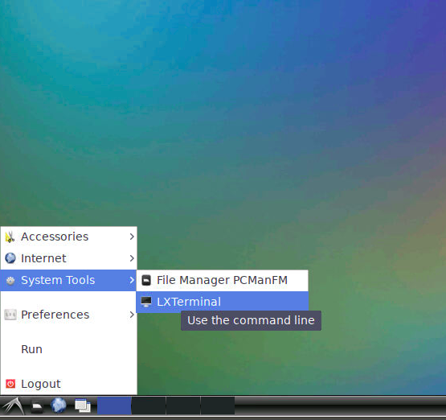

```{r setup, include=FALSE}
knitr::opts_chunk$set(echo = TRUE)
```

# Course Setup

In this course we will demonstrate how to run some standard analysis tools for RNA-seq data. The majority of Bioinformatics tools are built with a *command-line* environment in mind, rather than Windows or Mac OSX. To simplify the installation of these tools, we are providing some resources on the *cloud* that you can log into for the duration of the course. 

**You will receive a link to a spreadsheet containing a set of IP Addresses for each participant**

Enter the following address in your web browser, replacing **IP_ADDRESS** with your own **IP**.

```
http://IP_ADDRESS:6080
```

e.g. 

```
http://3.8.149.23:6080
```

The links will only be available for the duration of the workshop.

## Open a terminal window

You should be presented with a unix desktop environment that we can use to learn about the command-line and tools for processing RNA-seq data.

To open a *Terminal* (in order to enter Unix commands), there is a "Start menu" in the bottom-left corner from which you can select *System Tools* and then *LXTerminal*



## Change user

Finally, in order to follow the materials we need to change the user that we logged in as from `root` to `dcuser`.

Type the command into the terminal window **exactly** as it appears below

```
su - dcuser
```


You are now ready to start the command-line introduction

- [https://datacarpentry.org/shell-genomics/01-introduction/](https://datacarpentry.org/shell-genomics/01-introduction/)

# Setup on your own machine

Both Mac OSX and Windows 10 have the ability to run some of the commands presented in this course to navigate around a file system, copy files and list directories. However, you may prefer to practice in a "safe" environment, such as that used during the workshop. Furthermore, the NGS tools presented may be difficult to install. 

You can launch the same computing environment on your own machine using a tool called *Docker*.

Docker is an open platform for developers to build and ship applications, whether on laptops, servers in a data center, or the cloud.

- Or, it is a (relatively) painless way for you to install and try out Bioinformatics software.
- You can think of it as an isolated environment inside your exising operating system where you can install and run software without messing with the main OS
    + Really useful for testing software
    + Clear benefits for working reproducibly
- Instead of just distributing the code used for a paper, you can effectively share the computer you did the analysis on
- For those of you that have used Virtual Machines, it is a similar concept


## Installing Docker


### Mac

- [Mac OSX - 10.10.3 or newer](https://www.docker.com/docker-mac)
- [Older Macs](https://download.docker.com/mac/stable/DockerToolbox.pkg)

### Windows

- [Windows 10 Professional](https://www.docker.com/docker-windows)
- [Other Windows](https://download.docker.com/win/stable/DockerToolbox.exe)

Once you have installed Docker using the instructions above, you can open a terminal (Mac) or command prompt (Windows) and type the following to run the Day 1 environment

```
docker run --rm -p 6080:80 markdunning/rnaseq-toolbox
```

Entering the address in your web browser should display the environment

```
http://localhost:6080
```


### Using the environment to analyse your own data

With the default settings, the computing environment is isolated from your own laptop; we can neither bring files that we create back to our own OS, or analyse our own data.

However, adding an `-v` argument allows certain folders on your own OS to be visible within the environment. 

Assuming the files I want to analyse are to be found in the folder `PATH_TO_FASTQ`, the following command would map that directory to the folder `/home/dcuser/rnaseq_data`

```
docker run --rm -p 6080:80 -v /PATH_TO_FASTQ/:/home/dcuser/rnaseq_data markdunning/rnaseq-toolbox
```

At the terminal, we should be able to see our files with the `ls` command

```
ls /home/dcuser/rnaseq_data
```

However, please bear in mind that when running an analysis using this method you will be using the resources (CPU, RAM etc) *on your own machine*. In other words, it is not replacement for using a remote cluster with large amounts of memory (see next section).

Along with the tools used in the workshop, there are many other common RNA-seq tools included you may have read about in the literature:-

- [fastqc](https://www.bioinformatics.babraham.ac.uk/projects/fastqc/)
- [multiqc](https://multiqc.info/)
- [samtools](http://www.htslib.org/)
- [sra_toolkit](https://hpc.nih.gov/apps/sratoolkit.html)
- [bowtie2](http://bowtie-bio.sourceforge.net/bowtie2/index.shtml)
- [cutadapt](https://cutadapt.readthedocs.io/en/stable/)
- [htseq](https://htseq.readthedocs.io/en/master/)
- [hisat2](http://daehwankimlab.github.io/hisat2/)
- [subread](http://subread.sourceforge.net/)
- [kallisto](https://pachterlab.github.io/kallisto/about)
- [cufflinks](http://cole-trapnell-lab.github.io/cufflinks/)
- [RSEM](https://deweylab.github.io/RSEM/)
- [salmon](https://salmon.readthedocs.io/en/latest/salmon.html)
- [Trimmomatic](http://www.usadellab.org/cms/?page=trimmomatic)
  + `java -jar $TRIMMOMATIC`

### Analysis on the UoS cluster

As described above, `docker` can be used to run the environment presented in this course on a personal laptop. However, there are some security implications of docker that prohibits it being installed on a high-performance computing system. An alternative is `singularity`, which allows computing environments to be distributed as a single image file. We have created such a singularity image and made it available on sharc (The University of Sheffield's HPC).

Firstly, login to sharc in the usual manner and then open an interactive shell.

```{bash eval=FALSE}
ssh USERNAME@sharc.shef.ac.uk
qrsh
```

The singularity image is available at the following location:-

```{bash eval=FALSE}
ls /shared/bioinformatics_core1/Shared/software/singularity/command_line_20200212.sif
```

**The commands presented in the Introduction to Shell section (e.g. `ls`, `cd`, `pwd`...) are already available when you first login to `sharc`**. However, the tools specific to NGS analysis will require you to add the path to the singularity image before the command.

For example, to run `fastqc` you can navigate to your directory containing your fastq files with the usual `cd` command.

```{bash eval=FALSE}
cd /path/to/your/fastq/files
singularity exec /shared/bioinformatics_core1/Shared/software/singularity/command_line_20200212.sif fastqc *.fastq.gz
```

Other commands that require you to list give the path to the singularity image are as follows:-

```{bash eval=FALSE}
singularity exec /shared/bioinformatics_core1/Shared/software/singularity/command_line_20200212.sif multiqc
```

```{bash eval=FALSE}
singularity exec /shared/bioinformatics_core1/Shared/software/singularity/command_line_20200212.sif hisat2-build
```


```{bash eval=FALSE}
singularity exec /shared/bioinformatics_core1/Shared/software/singularity/command_line_20200212.sif hisat2 
```

```{bash eval=FALSE}
singularity exec /shared/bioinformatics_core1/Shared/software/singularity/command_line_20200212.sif samtools 
```

```{bash eval=FALSE}
singularity exec /shared/bioinformatics_core1/Shared/software/singularity/command_line_20200212.sif featureCounts
```

```{bash eval=FALSE}
singularity exec /shared/bioinformatics_core1/Shared/software/singularity/command_line_20200212.sif salmon
```

